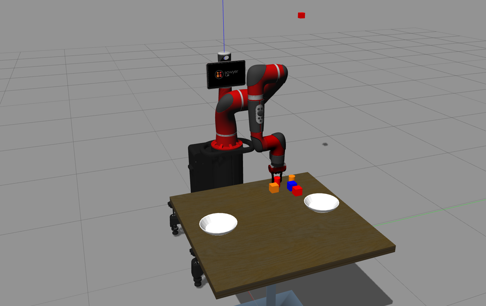

# Sawyer robot control program
## Record_pos
 1. People could control sawyer robot on Gazebo simulator by giving a position order.
 2. People could also record real robot configurations and replay the poses.
 Now the replaying is based on position directly computed from cubic spline formula. The plots are cubic spline lines but with a delaying position release. One way is to use trajectory control mode, the other is to use thread control.
### Results?
## Simulator examples
 Fix the issue that this would overwrite Gazebo simulator example folder.
 The way to launch it: easily by typing "roslaunch sawyer_sim_examples sawyer_pick_and_place_demo.launch" in your workspace after sourcing your files.

